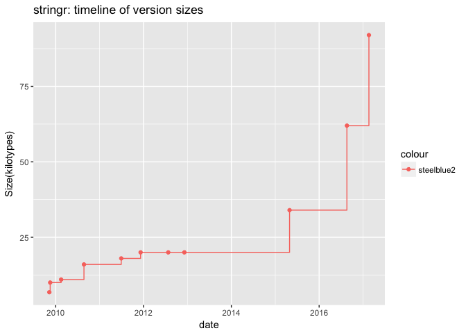
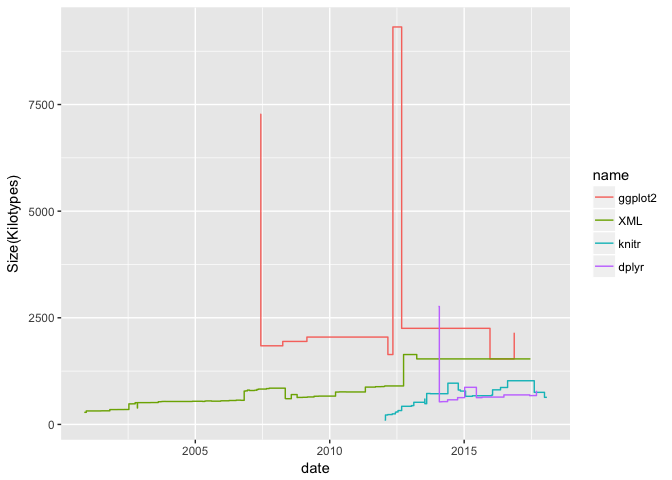
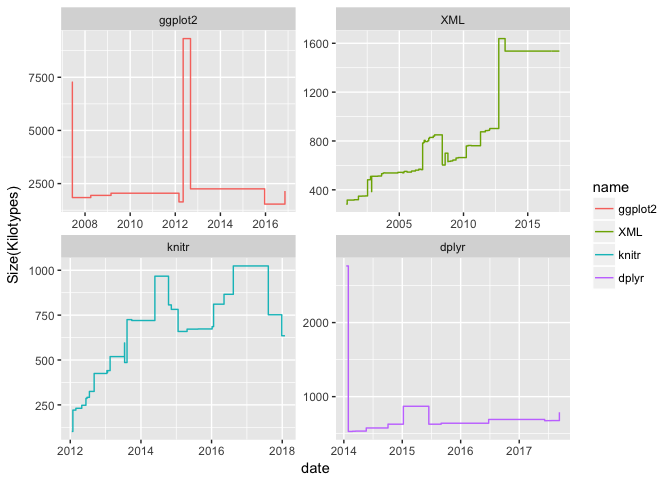
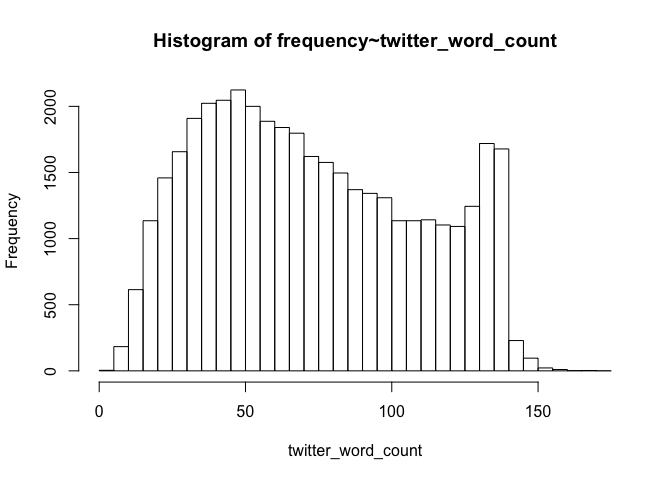
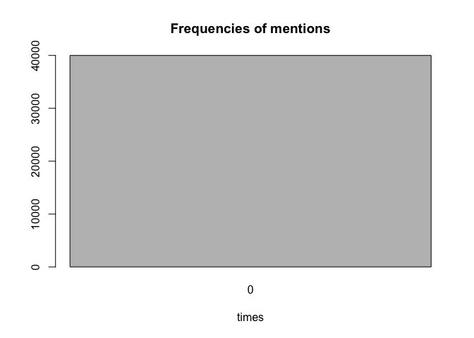
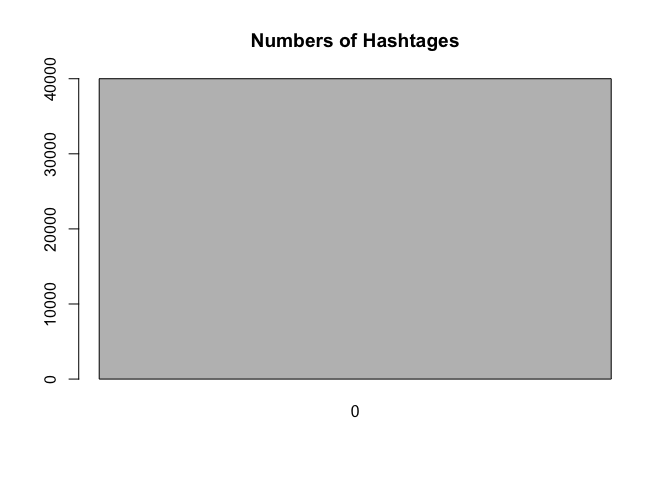

hw04-molly-li
================
Molly Li
4/4/2018

``` r
#stuff from r script
library(XML)
```

    ## Warning: package 'XML' was built under R version 3.3.2

``` r
library(stringr)
```

    ## Warning: package 'stringr' was built under R version 3.3.2

``` r
tbl_html <- readHTMLTable('http://cran.r-project.org/src/contrib/Archive/stringr')
tbl_html
```

    ## $`NULL`
    ##                      Name    Last modified Size Description
    ## 1                    <NA>             <NA> <NA>        <NA>
    ## 2        Parent Directory                     -            
    ## 3   stringr_0.1.10.tar.gz 2009-11-09 16:57 6.8K            
    ## 4      stringr_0.2.tar.gz 2009-11-16 20:25  10K            
    ## 5      stringr_0.3.tar.gz 2010-02-15 18:06  11K            
    ## 6      stringr_0.4.tar.gz 2010-08-24 16:33  16K            
    ## 7      stringr_0.5.tar.gz 2011-06-30 19:12  18K            
    ## 8    stringr_0.6.1.tar.gz 2012-07-25 21:59  20K            
    ## 9    stringr_0.6.2.tar.gz 2012-12-06 08:40  20K            
    ## 10     stringr_0.6.tar.gz 2011-12-08 20:02  20K            
    ## 11   stringr_1.0.0.tar.gz 2015-04-30 11:48  34K            
    ## 12   stringr_1.1.0.tar.gz 2016-08-19 21:02  62K            
    ## 13   stringr_1.2.0.tar.gz 2017-02-18 21:23  92K            
    ## 14                   <NA>             <NA> <NA>        <NA>

``` r
#remove NA
tbl_html$`NULL`
```

    ##                      Name    Last modified Size Description
    ## 1                    <NA>             <NA> <NA>        <NA>
    ## 2        Parent Directory                     -            
    ## 3   stringr_0.1.10.tar.gz 2009-11-09 16:57 6.8K            
    ## 4      stringr_0.2.tar.gz 2009-11-16 20:25  10K            
    ## 5      stringr_0.3.tar.gz 2010-02-15 18:06  11K            
    ## 6      stringr_0.4.tar.gz 2010-08-24 16:33  16K            
    ## 7      stringr_0.5.tar.gz 2011-06-30 19:12  18K            
    ## 8    stringr_0.6.1.tar.gz 2012-07-25 21:59  20K            
    ## 9    stringr_0.6.2.tar.gz 2012-12-06 08:40  20K            
    ## 10     stringr_0.6.tar.gz 2011-12-08 20:02  20K            
    ## 11   stringr_1.0.0.tar.gz 2015-04-30 11:48  34K            
    ## 12   stringr_1.1.0.tar.gz 2016-08-19 21:02  62K            
    ## 13   stringr_1.2.0.tar.gz 2017-02-18 21:23  92K            
    ## 14                   <NA>             <NA> <NA>        <NA>

``` r
df <- tbl_html$`NULL`
dat <- na.omit(df)[-1,]


#1.1) read archive
read_archive <- function(x){
  a <- str_replace('http://cran.r-project.org/src/contrib/Archive/stringr', "stringr", x)
  b <- readHTMLTable(a)
  c <- b$`NULL`
  d <- na.omit(c)[-1,]
  return(d)
}

raw_data <- read_archive('stringr')
raw_data
```

    ##                      Name    Last modified Size Description
    ## 3   stringr_0.1.10.tar.gz 2009-11-09 16:57 6.8K            
    ## 4      stringr_0.2.tar.gz 2009-11-16 20:25  10K            
    ## 5      stringr_0.3.tar.gz 2010-02-15 18:06  11K            
    ## 6      stringr_0.4.tar.gz 2010-08-24 16:33  16K            
    ## 7      stringr_0.5.tar.gz 2011-06-30 19:12  18K            
    ## 8    stringr_0.6.1.tar.gz 2012-07-25 21:59  20K            
    ## 9    stringr_0.6.2.tar.gz 2012-12-06 08:40  20K            
    ## 10     stringr_0.6.tar.gz 2011-12-08 20:02  20K            
    ## 11   stringr_1.0.0.tar.gz 2015-04-30 11:48  34K            
    ## 12   stringr_1.1.0.tar.gz 2016-08-19 21:02  62K            
    ## 13   stringr_1.2.0.tar.gz 2017-02-18 21:23  92K

``` r
#1.2 Data Cleaning

version_names <- function (x) {
  name1 <- str_split(read_archive(x)$Name, pattern = "_")
  name2 <- lapply(name1, function(x) x[1])
  name3 <- as.character(unlist(name2))
  return(name3)
}

version_names('stringr')
```

    ##  [1] "stringr" "stringr" "stringr" "stringr" "stringr" "stringr" "stringr"
    ##  [8] "stringr" "stringr" "stringr" "stringr"

``` r
version_numbers <- function(x) {
  name1 <- str_split(read_archive(x)$Name, pattern = "_")
  number1 <- lapply(name1, function(x) x[2])
  number2 <- str_sub(number1, start = 1, end = -8)
  return(number2)
}
version_numbers('stringr')
```

    ##  [1] "0.1.10" "0.2"    "0.3"    "0.4"    "0.5"    "0.6.1"  "0.6.2" 
    ##  [8] "0.6"    "1.0.0"  "1.1.0"  "1.2.0"

``` r
version_dates <- function(x) {
  date1 <- str_sub(read_archive(x)$"Last modified", start = 1, end = 10)
  date2 <- as.Date(date1)
  return(date2)
}
version_dates('stringr')
```

    ## Warning in strptime(xx, f <- "%Y-%m-%d", tz = "GMT"): unknown timezone
    ## 'zone/tz/2018c.1.0/zoneinfo/America/Los_Angeles'

    ##  [1] "2009-11-09" "2009-11-16" "2010-02-15" "2010-08-24" "2011-06-30"
    ##  [6] "2012-07-25" "2012-12-06" "2011-12-08" "2015-04-30" "2016-08-19"
    ## [11] "2017-02-18"

``` r
version_sizes <- function(x) {
  size1 <- which(str_detect(read_archive(x)$Size, "M"))
  size2 <- as.numeric(str_replace(read_archive(x)$Size, 'M|K', ''))
  size2[size1] <- size2[size1]*1024
  return(size2)
}
version_sizes('stringr')
```

    ##  [1]  6.8 10.0 11.0 16.0 18.0 20.0 20.0 20.0 34.0 62.0 92.0

``` r
clean_archive <- function(x) {
  name <- version_names(x)
  version <- version_numbers(x)
  date <- version_dates(x)
  size <- version_sizes(x)
  clean1 <- data.frame(name, version, date, size)
  return(clean1)
}

clean_data <- clean_archive("stringr")
clean_data
```

    ##       name version       date size
    ## 1  stringr  0.1.10 2009-11-09  6.8
    ## 2  stringr     0.2 2009-11-16 10.0
    ## 3  stringr     0.3 2010-02-15 11.0
    ## 4  stringr     0.4 2010-08-24 16.0
    ## 5  stringr     0.5 2011-06-30 18.0
    ## 6  stringr   0.6.1 2012-07-25 20.0
    ## 7  stringr   0.6.2 2012-12-06 20.0
    ## 8  stringr     0.6 2011-12-08 20.0
    ## 9  stringr   1.0.0 2015-04-30 34.0
    ## 10 stringr   1.1.0 2016-08-19 62.0
    ## 11 stringr   1.2.0 2017-02-18 92.0

``` r
# 1.3) Timeline plot
# write a function plot_archive() to visualize the timeline with the version sizes of a package.
library(ggplot2)
```

    ## Warning: package 'ggplot2' was built under R version 3.3.2

``` r
plot_archive <- function(x) {
  ggplot(data = x, mapping = aes(date, size, group = 1)) +
    geom_point(aes(date, size, col = "steelblue2")) +
    geom_step(aes(date, size, col = "steelblue2")) +
    ggtitle(paste0(x$name[1],': timeline of version sizes')) +
    xlab('date') +
    ylab('Size(kilotypes)')
}
plot_archive(clean_data)
```



``` r
library(ggplot2)
```

1.4) Archive of "stringr"
=========================

``` r
raw_data <- read_archive('stringr')
clean_data <- clean_archive('stringr')

plot_archive(clean_data)
```


1.5) Archives of "splyr", "ggplot2", "XML", and "knitr"
=======================================================

``` r
clean_data2 <- clean_archive('ggplot2')
clean_data2
```

    ##       name version       date   size
    ## 1  ggplot2   0.5.1 2007-06-10 1843.2
    ## 2  ggplot2   0.5.2 2007-06-18 1843.2
    ## 3  ggplot2   0.5.4 2007-07-08 1843.2
    ## 4  ggplot2   0.5.5 2007-09-01 1843.2
    ## 5  ggplot2   0.5.6 2007-10-20 1843.2
    ## 6  ggplot2   0.5.7 2008-01-11 1843.2
    ## 7  ggplot2     0.5 2007-06-01 7270.4
    ## 8  ggplot2     0.6 2008-04-03 1945.6
    ## 9  ggplot2     0.7 2008-10-05 1945.6
    ## 10 ggplot2   0.8.1 2008-12-14 1945.6
    ## 11 ggplot2   0.8.2 2009-02-25 2048.0
    ## 12 ggplot2   0.8.3 2009-04-20 2048.0
    ## 13 ggplot2   0.8.4 2009-12-09 2048.0
    ## 14 ggplot2   0.8.5 2009-12-16 2048.0
    ## 15 ggplot2   0.8.6 2010-02-18 2048.0
    ## 16 ggplot2   0.8.7 2010-03-02 2048.0
    ## 17 ggplot2   0.8.8 2010-07-05 2048.0
    ## 18 ggplot2   0.8.9 2010-12-23 2048.0
    ## 19 ggplot2     0.8 2008-11-21 1945.6
    ## 20 ggplot2   0.9.0 2012-03-01 1638.4
    ## 21 ggplot2   0.9.1 2012-05-08 9318.4
    ## 22 ggplot2 0.9.2.1 2012-09-11 2252.8
    ## 23 ggplot2   0.9.2 2012-09-04 2252.8
    ## 24 ggplot2 0.9.3.1 2013-03-02 2252.8
    ## 25 ggplot2   0.9.3 2012-12-05 2252.8
    ## 26 ggplot2   1.0.0 2014-05-21 2252.8
    ## 27 ggplot2   1.0.1 2015-03-17 2252.8
    ## 28 ggplot2   2.0.0 2015-12-18 1536.0
    ## 29 ggplot2   2.1.0 2016-03-01 1536.0
    ## 30 ggplot2   2.2.0 2016-11-11 2150.4

``` r
write.csv(clean_data2, file = '../data/ggplot2-archive.csv')

clean_data3 <- clean_archive('XML')
clean_data3
```

    ##     name  version       date   size
    ## 1    XML      0.2 2000-11-15  283.0
    ## 2    XML    0.3-3 2000-12-12  316.0
    ## 3    XML    0.6-1 2001-06-28  319.0
    ## 4    XML    0.6-2 2001-06-28  318.0
    ## 5    XML    0.6-3 2001-07-11  319.0
    ## 6    XML    0.7-0 2001-10-28  348.0
    ## 7    XML    0.7-1 2001-10-30  348.0
    ## 8    XML    0.7-2 2001-11-29  348.0
    ## 9    XML    0.7-3 2002-02-01  348.0
    ## 10   XML    0.7-4 2002-02-08  349.0
    ## 11   XML    0.7-5 2002-03-27  349.0
    ## 12   XML    0.8-0 2002-04-26  349.0
    ## 13   XML    0.8-2 2002-05-10  350.0
    ## 14   XML    0.9-0 2002-07-14  482.0
    ## 15   XML    0.9-1 2002-08-30  483.0
    ## 16   XML   0.92-1 2002-10-07  510.0
    ## 17   XML   0.92-2 2002-10-12  510.0
    ## 18   XML   0.93-0 2002-11-06  385.0
    ## 19   XML   0.93-1 2002-11-08  511.0
    ## 20   XML   0.93-2 2003-03-05  511.0
    ## 21   XML   0.93-3 2003-03-09  511.0
    ## 22   XML   0.93-4 2003-05-04  513.0
    ## 23   XML   0.94-0 2003-08-15  515.0
    ## 24   XML   0.94-1 2003-08-17  532.0
    ## 25   XML   0.95-0 2003-09-23  535.0
    ## 26   XML   0.95-1 2003-10-01  535.0
    ## 27   XML   0.95-3 2003-10-07  538.0
    ## 28   XML   0.95-4 2003-10-28  539.0
    ## 29   XML   0.95-6 2003-11-26  538.0
    ## 30   XML   0.97-0 2004-11-22  543.0
    ## 31   XML   0.97-3 2005-04-08  539.0
    ## 32   XML   0.97-4 2005-05-09  546.0
    ## 33   XML   0.97-6 2005-05-21  550.0
    ## 34   XML   0.97-7 2005-06-02  551.0
    ## 35   XML   0.97-8 2005-08-10  545.0
    ## 36   XML   0.99-2 2005-12-12  552.0
    ## 37   XML   0.99-4 2005-12-16  553.0
    ## 38   XML   0.99-5 2005-12-21  554.0
    ## 39   XML   0.99-6 2006-01-01  554.0
    ## 40   XML   0.99-7 2006-04-05  561.0
    ## 41   XML   0.99-8 2006-07-10  569.0
    ## 42   XML  0.99-92 2006-09-11  565.0
    ## 43   XML  0.99-93 2006-09-15  565.0
    ## 44   XML    1.1-1 2006-10-27  782.0
    ## 45   XML    1.2-0 2006-11-15  787.0
    ## 46   XML    1.3-2 2006-12-10  805.0
    ## 47   XML    1.4-0 2006-12-16  805.0
    ## 48   XML    1.4-1 2007-01-07  795.0
    ## 49   XML    1.5-1 2007-03-14  797.0
    ## 50   XML    1.6-0 2007-03-15  798.0
    ## 51   XML    1.6-2 2007-03-27  801.0
    ## 52   XML    1.6-3 2007-04-06  801.0
    ## 53   XML    1.7-1 2007-04-18  820.0
    ## 54   XML    1.7-2 2007-04-23  820.0
    ## 55   XML    1.7-3 2007-04-26  821.0
    ## 56   XML    1.9-0 2007-05-10  829.0
    ## 57   XML   1.92-0 2007-08-25  840.0
    ## 58   XML   1.92-1 2007-09-01  840.0
    ## 59   XML   1.93-1 2007-10-01  849.0
    ## 60   XML   1.93-2 2007-10-03  850.0
    ## 61   XML   1.95-1 2008-05-07  609.0
    ## 62   XML   1.95-2 2008-05-13  603.0
    ## 63   XML   1.95-3 2008-06-27  603.0
    ## 64   XML   1.96-0 2008-07-28  700.0
    ## 65   XML   1.98-0 2008-10-15  630.0
    ## 66   XML   1.98-1 2008-10-20  633.0
    ## 67   XML   1.99-0 2008-12-30  636.0
    ## 68   XML    2.1-0 2009-02-19  638.0
    ## 69   XML    2.3-0 2009-03-06  644.0
    ## 70   XML    2.5-0 2009-06-02  660.0
    ## 71   XML    2.5-1 2009-06-07  660.0
    ## 72   XML    2.5-3 2009-06-25  661.0
    ## 73   XML    2.6-0 2009-08-04  664.0
    ## 74   XML    2.8-1 2010-03-21  759.0
    ## 75   XML    3.1-0 2010-05-08  763.0
    ## 76   XML    3.1-1 2010-08-12  761.0
    ## 77   XML    3.2-0 2010-10-05  761.0
    ## 78   XML    3.4-0 2011-04-30  875.0
    ## 79   XML    3.4-2 2011-08-04  875.0
    ## 80   XML    3.4-3 2011-09-14  885.0
    ## 81   XML    3.6-0 2011-11-29  887.0
    ## 82   XML    3.6-1 2011-11-30  887.0
    ## 83   XML    3.6-2 2011-12-09  887.0
    ## 84   XML    3.7-2 2012-01-08  890.0
    ## 85   XML    3.7-3 2012-01-11  890.0
    ## 86   XML    3.7-4 2012-01-12  890.0
    ## 87   XML    3.8-0 2012-01-14  894.0
    ## 88   XML    3.9-0 2012-01-18  901.0
    ## 89   XML    3.9-2 2012-01-21  902.0
    ## 90   XML    3.9-4 2012-01-31  902.0
    ## 91   XML 3.95-0.1 2012-10-02 1638.4
    ## 92   XML 3.95-0.2 2013-03-07 1638.4
    ## 93   XML   3.95-0 2012-09-30 1638.4
    ## 94   XML 3.96-0.1 2013-03-20 1638.4
    ## 95   XML 3.96-0.2 2013-03-21 1638.4
    ## 96   XML 3.96-1.1 2013-03-28 1536.0
    ## 97   XML 3.98-1.1 2013-06-20 1536.0
    ## 98   XML 3.98-1.2 2015-05-31 1536.0
    ## 99   XML 3.98-1.3 2015-06-30 1536.0
    ## 100  XML 3.98-1.4 2016-03-01 1536.0
    ## 101  XML 3.98-1.5 2016-11-10 1536.0
    ## 102  XML 3.98-1.6 2017-03-30 1536.0
    ## 103  XML 3.98-1.7 2017-05-03 1536.0
    ## 104  XML 3.98-1.8 2017-06-15 1536.0
    ## 105  XML 3.98-1.9 2017-06-19 1536.0

``` r
write.csv(clean_data3, file = '../data/XML-archive.csv')

clean_data4 <- clean_archive('knitr')
clean_data4
```

    ##     name version       date size
    ## 1  knitr     0.1 2012-01-17  102
    ## 2  knitr     0.2 2012-01-28  221
    ## 3  knitr     0.3 2012-02-28  231
    ## 4  knitr     0.4 2012-04-29  236
    ## 5  knitr     0.5 2012-04-29  248
    ## 6  knitr   0.6.3 2012-06-22  292
    ## 7  knitr     0.6 2012-06-11  286
    ## 8  knitr     0.7 2012-07-17  325
    ## 9  knitr     0.8 2012-09-04  425
    ## 10 knitr     0.9 2013-01-20  431
    ## 11 knitr   1.0.5 2013-01-21  441
    ## 12 knitr     1.0 2013-01-14  441
    ## 13 knitr     1.1 2013-02-16  519
    ## 14 knitr     1.2 2013-07-16  486
    ## 15 knitr     1.3 2013-07-15  595
    ## 16 knitr   1.4.1 2013-08-12  725
    ## 17 knitr     1.4 2013-08-10  725
    ## 18 knitr     1.5 2013-09-28  720
    ## 19 knitr     1.6 2014-05-25  967
    ## 20 knitr     1.7 2014-10-13  807
    ## 21 knitr     1.8 2014-11-11  782
    ## 22 knitr     1.9 2015-01-20  659
    ## 23 knitr  1.10.5 2015-05-06  672
    ## 24 knitr    1.10 2015-04-23  672
    ## 25 knitr    1.11 2015-08-14  673
    ## 26 knitr  1.12.3 2016-01-22  811
    ## 27 knitr    1.12 2016-01-07  686
    ## 28 knitr    1.13 2016-05-09  866
    ## 29 knitr    1.14 2016-08-13 1024
    ## 30 knitr  1.15.1 2016-11-22 1024
    ## 31 knitr    1.15 2016-11-09 1024
    ## 32 knitr    1.16 2017-05-18 1024
    ## 33 knitr    1.17 2017-08-10  752
    ## 34 knitr    1.18 2017-12-27  635
    ## 35 knitr    1.19 2018-01-29  635

``` r
write.csv(clean_data4, file = '../data/knitr-archive.csv')

clean_data5 <- clean_archive('dplyr')
clean_data5
```

    ##     name version       date   size
    ## 1  dplyr   0.1.1 2014-01-29  530.0
    ## 2  dplyr   0.1.2 2014-02-24  533.0
    ## 3  dplyr   0.1.3 2014-03-15  535.0
    ## 4  dplyr     0.1 2014-01-16 2764.8
    ## 5  dplyr     0.2 2014-05-21  577.0
    ## 6  dplyr 0.3.0.1 2014-10-08  629.0
    ## 7  dplyr 0.3.0.2 2014-10-11  628.0
    ## 8  dplyr     0.3 2014-10-04  629.0
    ## 9  dplyr   0.4.0 2015-01-08  870.0
    ## 10 dplyr   0.4.1 2015-01-14  870.0
    ## 11 dplyr   0.4.2 2015-06-16  628.0
    ## 12 dplyr   0.4.3 2015-09-01  641.0
    ## 13 dplyr   0.5.0 2016-06-24  692.0
    ## 14 dplyr   0.7.0 2017-06-09  675.0
    ## 15 dplyr   0.7.1 2017-06-22  676.0
    ## 16 dplyr   0.7.2 2017-07-21  677.0
    ## 17 dplyr   0.7.3 2017-09-09  789.0

``` r
write.csv(clean_data5, file = '../data/dplyr-archive.csv')

df <- rbind(clean_data2, clean_data3, clean_data4, clean_data5)
df
```

    ##        name  version       date   size
    ## 1   ggplot2    0.5.1 2007-06-10 1843.2
    ## 2   ggplot2    0.5.2 2007-06-18 1843.2
    ## 3   ggplot2    0.5.4 2007-07-08 1843.2
    ## 4   ggplot2    0.5.5 2007-09-01 1843.2
    ## 5   ggplot2    0.5.6 2007-10-20 1843.2
    ## 6   ggplot2    0.5.7 2008-01-11 1843.2
    ## 7   ggplot2      0.5 2007-06-01 7270.4
    ## 8   ggplot2      0.6 2008-04-03 1945.6
    ## 9   ggplot2      0.7 2008-10-05 1945.6
    ## 10  ggplot2    0.8.1 2008-12-14 1945.6
    ## 11  ggplot2    0.8.2 2009-02-25 2048.0
    ## 12  ggplot2    0.8.3 2009-04-20 2048.0
    ## 13  ggplot2    0.8.4 2009-12-09 2048.0
    ## 14  ggplot2    0.8.5 2009-12-16 2048.0
    ## 15  ggplot2    0.8.6 2010-02-18 2048.0
    ## 16  ggplot2    0.8.7 2010-03-02 2048.0
    ## 17  ggplot2    0.8.8 2010-07-05 2048.0
    ## 18  ggplot2    0.8.9 2010-12-23 2048.0
    ## 19  ggplot2      0.8 2008-11-21 1945.6
    ## 20  ggplot2    0.9.0 2012-03-01 1638.4
    ## 21  ggplot2    0.9.1 2012-05-08 9318.4
    ## 22  ggplot2  0.9.2.1 2012-09-11 2252.8
    ## 23  ggplot2    0.9.2 2012-09-04 2252.8
    ## 24  ggplot2  0.9.3.1 2013-03-02 2252.8
    ## 25  ggplot2    0.9.3 2012-12-05 2252.8
    ## 26  ggplot2    1.0.0 2014-05-21 2252.8
    ## 27  ggplot2    1.0.1 2015-03-17 2252.8
    ## 28  ggplot2    2.0.0 2015-12-18 1536.0
    ## 29  ggplot2    2.1.0 2016-03-01 1536.0
    ## 30  ggplot2    2.2.0 2016-11-11 2150.4
    ## 31      XML      0.2 2000-11-15  283.0
    ## 32      XML    0.3-3 2000-12-12  316.0
    ## 33      XML    0.6-1 2001-06-28  319.0
    ## 34      XML    0.6-2 2001-06-28  318.0
    ## 35      XML    0.6-3 2001-07-11  319.0
    ## 36      XML    0.7-0 2001-10-28  348.0
    ## 37      XML    0.7-1 2001-10-30  348.0
    ## 38      XML    0.7-2 2001-11-29  348.0
    ## 39      XML    0.7-3 2002-02-01  348.0
    ## 40      XML    0.7-4 2002-02-08  349.0
    ## 41      XML    0.7-5 2002-03-27  349.0
    ## 42      XML    0.8-0 2002-04-26  349.0
    ## 43      XML    0.8-2 2002-05-10  350.0
    ## 44      XML    0.9-0 2002-07-14  482.0
    ## 45      XML    0.9-1 2002-08-30  483.0
    ## 46      XML   0.92-1 2002-10-07  510.0
    ## 47      XML   0.92-2 2002-10-12  510.0
    ## 48      XML   0.93-0 2002-11-06  385.0
    ## 49      XML   0.93-1 2002-11-08  511.0
    ## 50      XML   0.93-2 2003-03-05  511.0
    ## 51      XML   0.93-3 2003-03-09  511.0
    ## 52      XML   0.93-4 2003-05-04  513.0
    ## 53      XML   0.94-0 2003-08-15  515.0
    ## 54      XML   0.94-1 2003-08-17  532.0
    ## 55      XML   0.95-0 2003-09-23  535.0
    ## 56      XML   0.95-1 2003-10-01  535.0
    ## 57      XML   0.95-3 2003-10-07  538.0
    ## 58      XML   0.95-4 2003-10-28  539.0
    ## 59      XML   0.95-6 2003-11-26  538.0
    ## 60      XML   0.97-0 2004-11-22  543.0
    ## 61      XML   0.97-3 2005-04-08  539.0
    ## 62      XML   0.97-4 2005-05-09  546.0
    ## 63      XML   0.97-6 2005-05-21  550.0
    ## 64      XML   0.97-7 2005-06-02  551.0
    ## 65      XML   0.97-8 2005-08-10  545.0
    ## 66      XML   0.99-2 2005-12-12  552.0
    ## 67      XML   0.99-4 2005-12-16  553.0
    ## 68      XML   0.99-5 2005-12-21  554.0
    ## 69      XML   0.99-6 2006-01-01  554.0
    ## 70      XML   0.99-7 2006-04-05  561.0
    ## 71      XML   0.99-8 2006-07-10  569.0
    ## 72      XML  0.99-92 2006-09-11  565.0
    ## 73      XML  0.99-93 2006-09-15  565.0
    ## 74      XML    1.1-1 2006-10-27  782.0
    ## 75      XML    1.2-0 2006-11-15  787.0
    ## 76      XML    1.3-2 2006-12-10  805.0
    ## 77      XML    1.4-0 2006-12-16  805.0
    ## 78      XML    1.4-1 2007-01-07  795.0
    ## 79      XML    1.5-1 2007-03-14  797.0
    ## 80      XML    1.6-0 2007-03-15  798.0
    ## 81      XML    1.6-2 2007-03-27  801.0
    ## 82      XML    1.6-3 2007-04-06  801.0
    ## 83      XML    1.7-1 2007-04-18  820.0
    ## 84      XML    1.7-2 2007-04-23  820.0
    ## 85      XML    1.7-3 2007-04-26  821.0
    ## 86      XML    1.9-0 2007-05-10  829.0
    ## 87      XML   1.92-0 2007-08-25  840.0
    ## 88      XML   1.92-1 2007-09-01  840.0
    ## 89      XML   1.93-1 2007-10-01  849.0
    ## 90      XML   1.93-2 2007-10-03  850.0
    ## 91      XML   1.95-1 2008-05-07  609.0
    ## 92      XML   1.95-2 2008-05-13  603.0
    ## 93      XML   1.95-3 2008-06-27  603.0
    ## 94      XML   1.96-0 2008-07-28  700.0
    ## 95      XML   1.98-0 2008-10-15  630.0
    ## 96      XML   1.98-1 2008-10-20  633.0
    ## 97      XML   1.99-0 2008-12-30  636.0
    ## 98      XML    2.1-0 2009-02-19  638.0
    ## 99      XML    2.3-0 2009-03-06  644.0
    ## 100     XML    2.5-0 2009-06-02  660.0
    ## 101     XML    2.5-1 2009-06-07  660.0
    ## 102     XML    2.5-3 2009-06-25  661.0
    ## 103     XML    2.6-0 2009-08-04  664.0
    ## 104     XML    2.8-1 2010-03-21  759.0
    ## 105     XML    3.1-0 2010-05-08  763.0
    ## 106     XML    3.1-1 2010-08-12  761.0
    ## 107     XML    3.2-0 2010-10-05  761.0
    ## 108     XML    3.4-0 2011-04-30  875.0
    ## 109     XML    3.4-2 2011-08-04  875.0
    ## 110     XML    3.4-3 2011-09-14  885.0
    ## 111     XML    3.6-0 2011-11-29  887.0
    ## 112     XML    3.6-1 2011-11-30  887.0
    ## 113     XML    3.6-2 2011-12-09  887.0
    ## 114     XML    3.7-2 2012-01-08  890.0
    ## 115     XML    3.7-3 2012-01-11  890.0
    ## 116     XML    3.7-4 2012-01-12  890.0
    ## 117     XML    3.8-0 2012-01-14  894.0
    ## 118     XML    3.9-0 2012-01-18  901.0
    ## 119     XML    3.9-2 2012-01-21  902.0
    ## 120     XML    3.9-4 2012-01-31  902.0
    ## 121     XML 3.95-0.1 2012-10-02 1638.4
    ## 122     XML 3.95-0.2 2013-03-07 1638.4
    ## 123     XML   3.95-0 2012-09-30 1638.4
    ## 124     XML 3.96-0.1 2013-03-20 1638.4
    ## 125     XML 3.96-0.2 2013-03-21 1638.4
    ## 126     XML 3.96-1.1 2013-03-28 1536.0
    ## 127     XML 3.98-1.1 2013-06-20 1536.0
    ## 128     XML 3.98-1.2 2015-05-31 1536.0
    ## 129     XML 3.98-1.3 2015-06-30 1536.0
    ## 130     XML 3.98-1.4 2016-03-01 1536.0
    ## 131     XML 3.98-1.5 2016-11-10 1536.0
    ## 132     XML 3.98-1.6 2017-03-30 1536.0
    ## 133     XML 3.98-1.7 2017-05-03 1536.0
    ## 134     XML 3.98-1.8 2017-06-15 1536.0
    ## 135     XML 3.98-1.9 2017-06-19 1536.0
    ## 136   knitr      0.1 2012-01-17  102.0
    ## 137   knitr      0.2 2012-01-28  221.0
    ## 138   knitr      0.3 2012-02-28  231.0
    ## 139   knitr      0.4 2012-04-29  236.0
    ## 140   knitr      0.5 2012-04-29  248.0
    ## 141   knitr    0.6.3 2012-06-22  292.0
    ## 142   knitr      0.6 2012-06-11  286.0
    ## 143   knitr      0.7 2012-07-17  325.0
    ## 144   knitr      0.8 2012-09-04  425.0
    ## 145   knitr      0.9 2013-01-20  431.0
    ## 146   knitr    1.0.5 2013-01-21  441.0
    ## 147   knitr      1.0 2013-01-14  441.0
    ## 148   knitr      1.1 2013-02-16  519.0
    ## 149   knitr      1.2 2013-07-16  486.0
    ## 150   knitr      1.3 2013-07-15  595.0
    ## 151   knitr    1.4.1 2013-08-12  725.0
    ## 152   knitr      1.4 2013-08-10  725.0
    ## 153   knitr      1.5 2013-09-28  720.0
    ## 154   knitr      1.6 2014-05-25  967.0
    ## 155   knitr      1.7 2014-10-13  807.0
    ## 156   knitr      1.8 2014-11-11  782.0
    ## 157   knitr      1.9 2015-01-20  659.0
    ## 158   knitr   1.10.5 2015-05-06  672.0
    ## 159   knitr     1.10 2015-04-23  672.0
    ## 160   knitr     1.11 2015-08-14  673.0
    ## 161   knitr   1.12.3 2016-01-22  811.0
    ## 162   knitr     1.12 2016-01-07  686.0
    ## 163   knitr     1.13 2016-05-09  866.0
    ## 164   knitr     1.14 2016-08-13 1024.0
    ## 165   knitr   1.15.1 2016-11-22 1024.0
    ## 166   knitr     1.15 2016-11-09 1024.0
    ## 167   knitr     1.16 2017-05-18 1024.0
    ## 168   knitr     1.17 2017-08-10  752.0
    ## 169   knitr     1.18 2017-12-27  635.0
    ## 170   knitr     1.19 2018-01-29  635.0
    ## 171   dplyr    0.1.1 2014-01-29  530.0
    ## 172   dplyr    0.1.2 2014-02-24  533.0
    ## 173   dplyr    0.1.3 2014-03-15  535.0
    ## 174   dplyr      0.1 2014-01-16 2764.8
    ## 175   dplyr      0.2 2014-05-21  577.0
    ## 176   dplyr  0.3.0.1 2014-10-08  629.0
    ## 177   dplyr  0.3.0.2 2014-10-11  628.0
    ## 178   dplyr      0.3 2014-10-04  629.0
    ## 179   dplyr    0.4.0 2015-01-08  870.0
    ## 180   dplyr    0.4.1 2015-01-14  870.0
    ## 181   dplyr    0.4.2 2015-06-16  628.0
    ## 182   dplyr    0.4.3 2015-09-01  641.0
    ## 183   dplyr    0.5.0 2016-06-24  692.0
    ## 184   dplyr    0.7.0 2017-06-09  675.0
    ## 185   dplyr    0.7.1 2017-06-22  676.0
    ## 186   dplyr    0.7.2 2017-07-21  677.0
    ## 187   dplyr    0.7.3 2017-09-09  789.0

``` r
ggplot(data=df)+
  geom_step(aes(x=date, y=size, color=name))+
  xlab("date")+
  ylab("Size(Kilotypes)")
```



``` r
ggplot(data=df)+
  geom_step(aes(x=date, y=size, color=name))+
  xlab("date")+
  ylab("Size(Kilotypes)")+
  facet_wrap(~name, scales = "free")
```



3) Data “Emotion in Text”
-------------------------

3.1) Number of characters per tweet
===================================

``` r
URL <- "https://raw.githubusercontent.com/ucb-stat133/stat133-spring-2018/master/data/text-emotion.csv"
download.file(URL, "../data/text-emotion.csv")
```

``` r
text_emotion <- read.csv("../data/text-emotion.csv",stringsAsFactors = F)
```

``` r
word_count <- nchar(text_emotion$content)
frequency_wc<- table(word_count)
summary(word_count)
```

    ##    Min. 1st Qu.  Median    Mean 3rd Qu.    Max. 
    ##    1.00   43.00   69.00   73.41  103.00  167.00

``` r
hist(word_count,breaks = seq(0,175,5) , xlim = c(0,175), main = "Histogram of frequency~twitter_word_count",xlab = "twitter_word_count")
```



3.2) Number of Mentions
=======================

``` r
number_of_mentions <- rep(0, length(text_emotion$content))
k <- strsplit(text_emotion$content, " ")
for (i in 1:length(text_emotion$content)) {
  for (j in 1:length(k[[i]])) {
    if (length(split_chars(k[[i]][j])) >= 2){
      if (split_chars(k[[i]][j])[1] == "@") {
        if (!FALSE %in% (split_chars(k[[i]][j])[-1] %in% c(letters, toupper(letters), 1:9))){
          number_of_mentions[i] = number_of_mentions[i] + 1
        }
      }
    }
  }
}
```

    ## Error: could not find function "split_chars"

``` r
table(number_of_mentions)
```

    ## number_of_mentions
    ##     0 
    ## 40000

``` r
#Frequencies of mentions
barplot(table(number_of_mentions), xlab = "times", main = "Frequencies of mentions")
```



``` r
text_emotion$content[ number_of_mentions == 10]
```

    ## character(0)

3.3)Hashtags
============

``` r
tags = NULL
number_of_hash <- rep(0, length(text_emotion$content))
k <- strsplit(text_emotion$content, " ")
for (i in 1:length(text_emotion$content)) {
  for (j in 1:length(k[[i]])) {
    if (length(split_chars(k[[i]][j])) >= 2){
      if (split_chars(k[[i]][j])[1] == "#") {
        if (!FALSE %in% (split_chars(k[[i]][j])[-1] %in% c(letters, toupper(letters), 1:9, " "))){
          if (TRUE %in% (c(letters, toupper(letters)) %in% split_chars(k[[i]][j])[-1])) {
          number_of_hash[i] = number_of_hash[i] + 1
          tags = append(tags, k[[i]][j])
          }
        }
      }
    }
  }
}
```

    ## Error: could not find function "split_chars"

``` r
#count the number of hashtags 
sum(number_of_hash)
```

    ## [1] 0

``` r
# numbero of hastag
table(number_of_hash)
```

    ## number_of_hash
    ##     0 
    ## 40000

``` r
#barpolot

barplot(table(number_of_hash), main = "Numbers of Hashtages")
```



``` r
#average length of hashta
tl <- rep(0, length(tags))
for (i in 1:length(tags)) { 
  tl[i] = length(strsplit(tags, "")[[i]])
}
```

    ## Error in strsplit(tags, ""): non-character argument

``` r
mean(tl)
```

    ## [1] NaN

``` r
#the mode of hashtags
getmode <- function(v) {
   uniqv <- unique(v)
   uniqv[which.max(tabulate(match(v, uniqv)))]
}

getmode(tl)
```

    ## [1] NA
